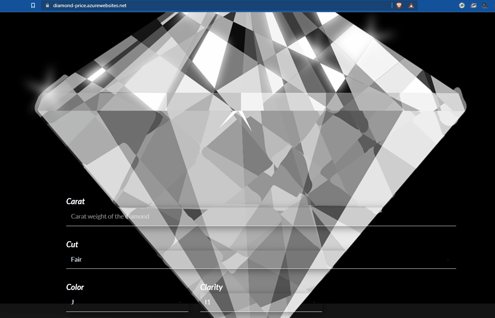

#Training and Deploying Tensorflow Model as a Web App on Azure to predict diamond price 

## Project Stucture
<pre>|   app.py                          # flask app python script  
|   requirements.txt                # requirements for the web  app  
|   training.ipynb                  # Notebook for training and   deploying on Azure  
+---training                        # Training Folder  
|       model.py  
|                              
+---data                            # Data folder  
|       diamonds.csv          
+---images                          # media for README  
|         
+---static                          # CSS and java script styles for the web app  
|             
+---templates                       # template for the web app  
|       index.html  
+---tf_env                          # Environement for deployment  
|         
|   config.json                     # Aure ML workspace config  
|   inf_env.yml                     # Environement for Inference  
|   myenv.yml                       # Conda env for running Notebook  
|   README.md  
</pre>

## Data Information
Data used in the project can be found on [kaggle](https://www.kaggle.com/soumyaranjan96/diamond-price-prediction/data)

### Attributes
Carat : Carat weight of the Diamond.  
Cut : Describe cut quality of the diamond. Quality in increasing order Fair, Good, Very Good, Premium, Ideal .  
Color : Color of the Diamond. from J (worst) to D (best)  
Clarity : Diamond Clarity refers to the absence of the Inclusions and Blemishes. In order from worst to best :- I1,SI2, SI1, VS2, VS1, VVS2, VVS1, IF  
Depth : The Height of a Diamond, measured from the Culet to the table, divided by its average Girdle Diameter.  
Table : The Width of the Diamond's Table expressed as a Percentage of its Average Diameter.  
X : Length of the Diamond in mm.  
Y : Width of the Diamond in mm.  
Z : Height of the Diamond in mm.  
Price : the Price of the Diamond.  
Qualitative Features (Categorical) : Cut, Color, Clarity.  
Quantitative Features (Numerical) : Carat, Depth , Table , Price , X , Y, Z.  

## Requirements
- Install Python (Conda distribution)
- Install VScode
- Create an Azure account

## Quickstart
1. Clone the repository  
   ` git clone https://github.com/amine-akrout/diamond-price-prediction `
2. Open and Run *training.ipynb*  

first make sure to add your own config file for the Azure ML workspace
Then Notebooke will:
- Connect to your working space 
- Upload and Register the data
- Training and log a DNN model as an experiment
- Register and deploy the model

Once the model deployed, you will be able to use it as a web service, to do so, run the *app.py* to test the web app locally on [localhost:5000]()

To deploy the web app on Azure, you need to create an [App service](https://azure.microsoft.com/en-us/services/app-service/) and link it to github via a [workflow](https://github.com/amine-akrout/diamond-price-prediction/blob/main/.github/workflows/main_diamond-price.yml)

Finally, you can use the app via the link: https://diamond-price.azurewebsites.net/

## Demo
